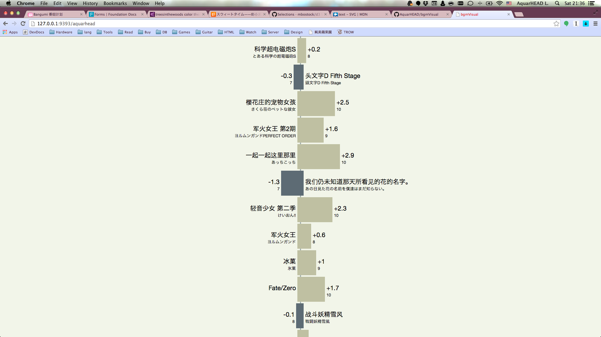

# Flag Map - bgmVisual

## Intro

Flag Map, 中文名｢风向图｣, 是我"原创"的一个 Layout, 嗯.. 起码名字是原创的(笑)

灵感来自 http://netaba.re/profile/aquarhead 是 bgm.tv 上一个求推荐动漫帖子里的链接, 在浏览自己看过的动漫时产生了比较自己的评分和网站上的平均评分这样一个想法.

于是设计了一个以一条直线串联表示评分差的方框为主体, 附上标题, 分差, 个人评分等信息的 Layout.

## Data

因为没有API, 也没有连接后台数据库的权限, 所有数据都是靠 ruby 脚本手动抓取的, 一旦要可视化的用户看过的动漫太多了就会等待很久...

测试的时候是用了我自己的帐号手动抓取的数据. 具体可见代码中 app.rb 53 ~ 145 行.

抓取数据的代码可见 20 ~ 46 行.

## Layout

在这个 Layout 中, 正中间的直线始终表示动漫的平均评分, 如果个人评分比平均分高, 则方框呈淡色, 向右拉伸, 拉伸的长度取决于个人评分与平均评分的分差, 反之, 如果个人评分比平均分低, 则呈深色, 向左拉伸.

+/-的数值表示分差, 下方的数字表示个人评分.

## Notes

全部代码开源在 Github: https://github.com/AquarHEAD/bgmVisual

采用我的静态数据的效果可见 http://bgmvisual.aquarhead.me/aquarhead/

主页在 http://bgmvisual.aquarhead.me/

可以尝试一下几个数据量比较小的用户名 babyblue lilianye 115920

bgmVisual 使用 [Foundation](http://foundation.zurb.com/) 框架搭建, 可视化部分采用 [D3.js](http://d3js.org/) 生成 SVG, 服务端采用 [Sinatra](http://www.sinatrarb.com/) + [Passenger](https://www.phusionpassenger.com/) + [Nginx](http://nginx.org/) 构成, 配色方案来自 [Adobe Kuler](https://kuler.adobe.com/treesinthewoods-color-theme-3277114/)

